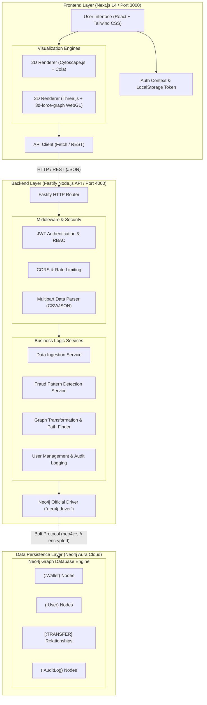
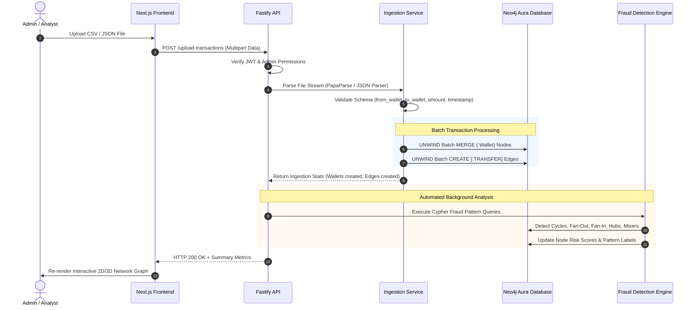
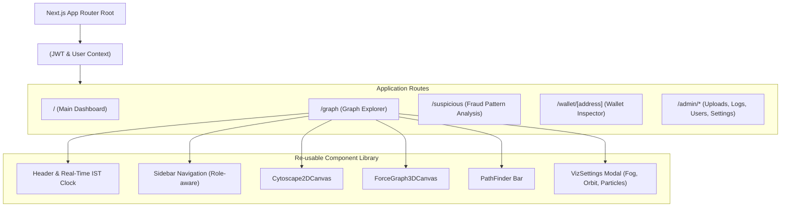
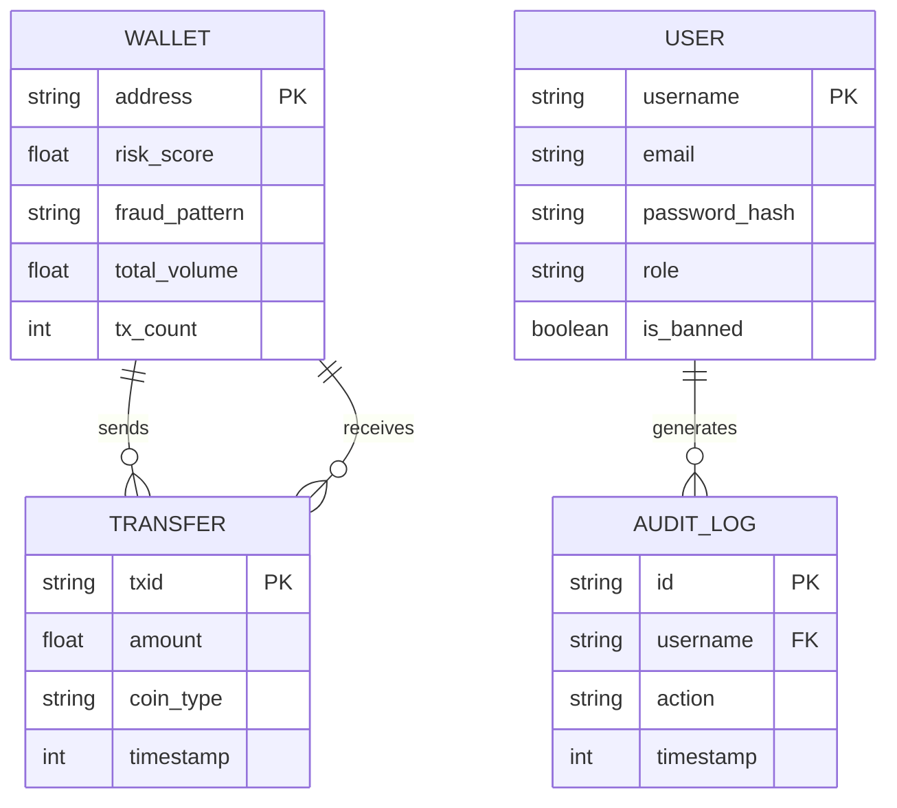

# DBMS — System Architecture & Presentation Diagrams

This document contains full architecture diagrams, component specifications, and data flow models for the **DBMS (Distributed Blockchain Monitoring & Fraud Detection System)**, structured for inclusion in presentation slides and documentation.

---

## 1. High-Level System Architecture Diagram

---

## 2. End-to-End Data Ingestion & Analysis Pipeline

---

## 3. Fraud Pattern Detection Logic & Classification Architecture

```mermaid
flowchart LR
    subgraph Inputs["Graph Analytics Queries (Cypher)"]
        Degrees["In-Degree / Out-Degree Ratios"]
        Cycles["Cycle Detection (1 to 4 hops)"]
        Vol["Transaction Volume Percentiles"]
        Velocity["Time Delta Between Transfers"]
    end

    subgraph Detector["Detection Engine Algorithms"]
        Circular["Circular Laundering (Cycles)"]
        FanOut["Fan-Out Distribution (Scams / Airdrop Abuse)"]
        FanIn["Fan-In Funneling (Collector Wallets)"]
        Hub["Hub Wallets (High-Volume Exchanges)"]
        Mixer["Mixer / Tumbler (High In + High Out Velocity)"]
    end

    subgraph Scoring["Risk Scoring Matrix"]
        ScoreCalc["Normalized Risk Score Calculation (0 - 100)"]
    end

    subgraph Classification["Visual Badges & Filter Categories"]
        HighRisk["🔴 High Risk (70 - 100)"]
        MedRisk["🟡 Medium Risk (40 - 69)"]
        LowRisk["🟢 Low Risk (0 - 39)"]
    end

    Inputs --> Detector
    Detector --> ScoreCalc
    ScoreCalc --> Classification
```

---

## 4. Frontend Component Hierarchy & State Flow

---

## 5. Database Graph Schema (Neo4j Cypher Model)

---

## 6. Slide-by-Slide Presentation Summary

### Slide 1: System Overview
- **Name:** DBMS — Distributed Blockchain Monitoring & Fraud Detection Platform
- **Core Stack:** Next.js 14, Fastify (Node.js), Neo4j Cloud (Aura DB), Cytoscape.js, Three.js (3D WebGL).
- **Primary Value:** Real-time visual network analysis and automated detection of crypto laundering/scam patterns.

### Slide 2: Key Architecture Highlights
- **Decoupled Architecture:** Clean separation of concerns between Next.js client, RESTful Fastify API, and Neo4j Graph Engine.
- **Dual-Mode Graph Visualization:**
  - **2D Engine:** Cytoscape.js + Cola physics for precise structure inspection.
  - **3D Engine:** Three.js WebGL renderer for high-density, large-scale network visualization.
- **Enterprise-Grade Security:** JWT authentication with role-based access control (Admin vs. Analyst), request rate-limiting, and comprehensive audit logging.

### Slide 3: Fraud Detection Capabilities
- **Circular Laundering:** Uncovers multi-hop transaction loops designed to obscure origins.
- **Fan-Out & Fan-In Detection:** Identifies rapid distribution hubs and collection wallets.
- **Mixers & Tumblers:** Pinpoints high-velocity mixing services using graph degree metrics.
- **Path Finder:** Calculates shortest transaction paths between arbitrary wallets in real time.
